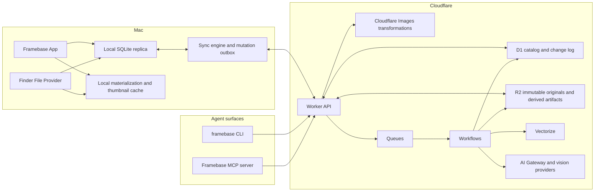
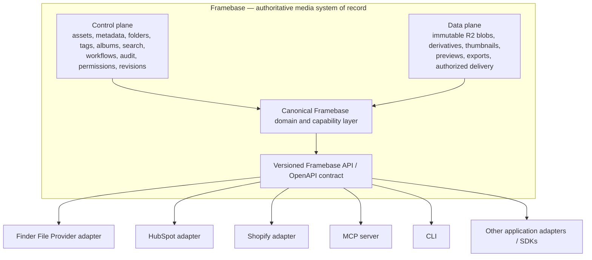

# Framebase Master Product Roadmap

## Document authority

This document is the overall product and delivery source of truth for Framebase.

- `docs/IMPLEMENTATION_PLAN.md` records the completed Phase 1 local-foundation implementation plan.
- Future implementation phases must receive a focused plan under `docs/phases/` before production code begins.
- `PROJECT.md` records current status and session handoffs.
- `AGENTS.md` contains durable engineering and safety rules.

If documents conflict, use this order:

1. The user's current explicit instruction.
2. This master roadmap for product scope, phase order, and exit gates.
3. The active phase plan for implementation detail.
4. The Phase 1 implementation plan for the already-built local foundation.

This roadmap is derived from the complete Framebase product conversation and the repository state inspected on 2026-08-08. Platform details must be reverified before each phase because Cloudflare and Apple capabilities can change.

## Status vocabulary

Framebase documentation must distinguish these states precisely:

- **Implemented locally** — code exists and has passed local verification.
- **Deployed to development** — cloud resources exist in a non-production environment and have deployment evidence.
- **Deployed to production** — the approved production environment is live and verified.
- **Planned** — described here but not yet implemented or deployed.
- **Deferred** — intentionally outside the active phase.

Nothing is “complete” without its phase exit gate. Phase completion never means the entire Framebase product is complete.

## Product definition

Framebase is a Mac-first, cloud-backed visual asset operating system for one private library. It combines:

- Finder's folder hierarchy and native file interaction.
- Immich's visual browsing and intelligent indexing.
- Lightroom Library's metadata depth and professional organization.
- Cloudinary's storage, delivery, and image transformation model.
- A reviewable automation and agent layer built for Codex, Claude, and other tools.

Framebase is not a chronological camera roll and is not intended to replace Apple Photos. The primary hierarchy is:

1. Folders
2. Assets
3. Albums and tags
4. Smart collections and saved searches
5. Search and similarity
6. Automations
7. Agent actions

### Product promise

The user can place a very large visual library into a durable private system, organize it quickly with native Mac interactions, find material through metadata or meaning, access it through Finder and other applications, and authorize AI or agents to perform reviewable work without risking original files.

### Full-product success

Framebase reaches its intended personal-product scope when it can:

- Store immutable originals in Cloudflare R2 while retaining local/offline usefulness.
- Synchronize the logical catalog between the Mac and the cloud without silent data loss.
- Deliver responsive thumbnails and previews without downloading originals unnecessarily.
- Expose the library through Finder using File Provider.
- Support folders, albums, tags, smart collections, trash, metadata, and powerful search.
- Perform OCR, captions, classifications, face grouping, and semantic similarity with explicit provenance.
- Run durable, reviewable workflows with dry-run, approval, audit, and undo semantics.
- Expose the same safe capabilities through OpenAPI, a CLI, and an MCP server.
- Protect private media, credentials, and originals even when automation makes a mistake.

Commercial multi-tenancy, social sharing, and a consumer mobile application are not required for this personal app.

## Current baseline — Phase 1 implemented locally

The existing application is the first product foundation, not the final product. It currently provides:

- A native SwiftUI/AppKit macOS application.
- A managed local library package with immutable UUID-keyed originals.
- A GRDB/SQLite catalog with assets, folders, albums, and album membership.
- A native folder source list with create, rename, reparent, delete-to-Inbox, undo, and redo.
- A native collection-view asset browser with paging, thumbnails, sorting, multi-selection, keyboard navigation, and drag-to-folder.
- Local still-image import, metadata extraction, previews, and bounded caches.
- Single- and multi-selection inspectors, favorites, ratings, and local settings.
- Package, UI, launch, and 100,000-record performance verification.

Phase 1 intentionally has no networking, cloud storage, synchronization, Finder File Provider, OCR, semantic search, workflows, or agent API.

## Architecture principles

### 1. Originals are immutable

An imported original is never renamed or moved because its logical Asset changes. Logical moves update catalog relationships. A destructive physical purge is a separate, delayed, approval-gated operation.

### 2. Blob and Asset are different entities

- A **Blob** represents immutable bytes, checksum, storage location, and retention state.
- An **Asset** represents the user's logical item: name, folder, albums, tags, metadata, ratings, and derived intelligence.

Multiple assets may eventually reference one identical blob after verified deduplication.

### 3. Cloud and local each have an explicit authority

- R2 is authoritative for remote original bytes.
- D1 is authoritative for the synchronized logical catalog after cloud cutover.
- Local SQLite is the Mac's replicated read model, offline mutation outbox, and performance cache.
- The local library package remains a recoverable source during migration and may retain selected originals for offline use.
- Vectorize stores derived embeddings, not catalog truth.
- Derived thumbnails, previews, OCR, captions, and embeddings can be regenerated.

### 4. The UI never becomes a cloud client directly

UI features call domain use cases. Remote transport, synchronization, storage, and authentication remain adapters behind protocols. The current native interface must remain usable during backend evolution.

### 5. One mutation pipeline serves humans, workflows, and agents

Every catalog mutation passes through the same validation, authorization, idempotency, revision, audit, and undo rules whether it originated in the Mac UI, Finder, a workflow, the CLI, or MCP.

### 6. Private by default

- No public R2 bucket.
- No permanent public asset URLs.
- No long-lived cloud credentials inside the app bundle.
- No original image or sensitive metadata in application logs.
- Cloud AI receives a bounded derivative by default, not the original.
- AI Gateway payload logging is disabled for private-image analysis.

### 7. Reversible before clever

Bulk AI and workflow changes produce a proposal first. The user can review the exact moves, renames, tags, or metadata changes before applying them. Applied changes produce audit events and reversible receipts.

## Target system architecture



## Integration adapter architecture

This is target architecture, not an implemented integration layer. Framebase is
the authoritative media system of record: a private visual asset-management
system that combines a logical catalog with immutable-original storage, media
delivery, transformations and derivatives, metadata, folders, albums, tags,
search, intelligence, workflows, audit history, access control, and
agent-accessible capabilities. It is not a generic “Media Bridge,” and it does
not need a separate generic Media Bridge service between Framebase and other
applications.

Cloudflare R2, caches, transformations, thumbnails, previews, and authorized
delivery are lower-level data-plane infrastructure. R2 stores immutable bytes;
delivery infrastructure serves authorized originals or derivatives; the
Framebase catalog and domain layer determine what an Asset means. Folder names,
logical organization, metadata, tags, albums, workflow state, audit history,
permissions, and revisions are Framebase concepts, not R2 concepts. The
existing Blob-versus-Asset distinction is therefore an integration boundary as
well as a storage boundary: integrations identify a logical Asset by its stable
Framebase ID, not by a filename or R2 key.



### One canonical capability surface

Framebase will expose its domain capabilities through one versioned API/OpenAPI
contract. The Mac app, sync engine, Finder adapter, workflows, CLI, MCP server,
and future external adapters must use the same domain/use-case layer rather
than independently reimplementing Framebase rules. The endpoint inventory is
intentionally not finalized here; representative capabilities include search
and inspection, import, folder creation, logical move and rename, tagging and
album membership, thumbnail/preview requests, authorized original download,
derivative creation, trash and restore, workflow/intelligence operations, and
audit inspection.

The deliberate external interfaces are:

- **REST / OpenAPI:** the canonical application-integration contract.
- **Finder File Provider:** the native macOS file-access interface, retaining
  catalog authority and on-demand materialization.
- **MCP:** a scoped, audited agent-facing wrapper over canonical capabilities.
- **CLI:** an operator and automation surface over the same capabilities.
- **Authorized delivery capabilities:** short-lived, bounded URLs or equivalent
  capabilities for displaying, previewing, transforming, or downloading a
  specific media resource; never long-lived infrastructure credentials.

### Adapter rules and integration invariants

An adapter translates an external model into the canonical Framebase model. It
does not become a second business-logic implementation or an alternate source
of truth. Every adapter must preserve the same validation, authorization,
idempotency, revision/conflict handling, audit, trash, approval,
undo/reversibility, and original-file protections as the Framebase application.

The following invariants apply to all future integrations:

1. **Framebase remains authoritative.** External systems receive projections or
   references unless an explicitly designed synchronization contract states
   otherwise.
2. **Stable Framebase IDs cross boundaries.** Filenames and R2 keys are not
   durable integration identity, and original storage keys remain implementation
   details.
3. **Infrastructure credentials never cross the boundary.** Adapters receive
   bounded API capabilities, not direct R2, D1, or Cloudflare credentials.
4. **Logical organization remains catalog based.** A logical rename or move
   does not move immutable blob bytes.
5. **Private by default remains in force.** Use thumbnails, previews, or other
   bounded derivatives before originals when the consuming system does not need
   original bytes; convenience never creates permanent public originals.
6. **Synchronization ownership is explicit.** An adapter must not silently
   create alternate truth for a field or entity, and audit attribution must
   identify the originating surface (for example Mac UI, Finder, workflow, CLI,
   MCP, HubSpot, or Shopify).
7. **Adapters stay replaceable.** No platform becomes embedded in the core
   Framebase domain without a genuine domain requirement. Platform API and
   capability assumptions must be reverified immediately before that adapter's
   implementation.

### Bridge terminology and concrete adapter examples

In Framebase, a **bridge** means a purpose-specific adapter between Framebase
and an external interface or platform:

- Finder File Provider: Finder and macOS applications ↔ Framebase.
- HubSpot Media Bridge integration: HubSpot ↔ Framebase.
- Shopify integration: Shopify ↔ Framebase.
- Framebase MCP server: AI and agent clients ↔ Framebase capabilities.
- Framebase CLI: command-line operators and automation ↔ Framebase
  capabilities.

Do not introduce a component named simply `MediaBridge`, or place a generic
middle service between Framebase, its API, and every external system, unless a
future architecture decision demonstrates a concrete need. That abstraction
would currently duplicate a boundary already owned by the canonical domain/API.

**Finder.** Finder remains the planned Apple File Provider integration from
Phase 5, not a custom generic bridge. It does not receive raw R2 authority or
manipulate R2 keys. Cloud-only assets materialize through Framebase's
authenticated API; Finder rename, move, folder, import, and trash operations
use the same catalog rules and synchronization/change model as the app. The
File Provider is not an independent filesystem or database authority.

**HubSpot.** “Media Bridge” is also the name of a specific HubSpot integration
capability/API. That product name does not make Framebase a HubSpot-style Media
Bridge. A future `Framebase HubSpot Connector` (or HubSpot adapter) may project
a Framebase Asset into a HubSpot Media Bridge representation:

```text
Framebase Asset
      |
      | Framebase HubSpot adapter
      v
HubSpot Media Bridge representation
```

Framebase remains authoritative. A projection may eventually include a stable
external asset ID, title/name, media type, authorized media and preview URLs,
a details link, and HubSpot-required metadata, but no schema is decided here.
The current official HubSpot Media Bridge API/documentation must be reverified
immediately before implementation.

**Shopify and other applications.** A future adapter may let a platform select,
reference, deliver, or synchronize Framebase-managed assets without making that
platform the original-media authority. It translates the platform-specific
model to Framebase's canonical domain/API; no implementation package or schema
is implied by this roadmap.

**MCP and CLI.** These are capability adapters too, not privileged storage
clients. They must not receive unrestricted database access, R2/private-storage
credentials, or destructive purge access outside the normal authorization
model. The existing dry-run, proposal, approval, and audit semantics continue
to apply to sensitive and bulk mutations.

### Change events and future integration sequencing

The ordered `ChangeEvent` model and `/v1/changes` are the future foundation for
integration synchronization. Adapters may eventually consume catalog changes
such as asset updates, trash/restore, folder changes, metadata updates,
derivative readiness, or workflow completion. Exact event names and webhook or
subscription mechanics remain future work; any such mechanism must layer on
the canonical change model rather than introduce a separate integration truth
source or require adapters to poll the full catalog.

No standalone “Media Bridge” phase is required. Future platform adapters depend
on the canonical Framebase domain model, versioned API/auth/sync contract, and
the relevant security foundation:

```text
Framebase domain model
        -> versioned API / auth / sync contract
        -> safe adapter foundation
        -> HubSpot / Shopify / other platform adapters
```

This preserves Finder's existing File Provider phase and CLI/MCP's existing
agent-platform phase. It also establishes these anti-goals: Framebase must not
become a thin wrapper around HubSpot, make Shopify or Finder authoritative,
expose R2 as the integration API, grant agents direct storage credentials,
duplicate mutation logic in every connector, create permanent public URLs for
convenience, or create speculative adapter packages before an approved phase
requires them.

### Target repository evolution

Add only what an active phase requires. The likely end state is:

```text
Framebase/
├── App/
├── UI/
├── FileProvider/                 # Added in the File Provider phase
├── Packages/FramebaseKit/
│   ├── Sources/
│   │   ├── FramebaseDomain/
│   │   ├── FramebaseCatalog/
│   │   ├── FramebaseMedia/
│   │   ├── FramebaseSync/        # Added with cloud synchronization
│   │   ├── FramebaseAPIClient/   # Added from the versioned API contract
│   │   └── FramebaseIntelligence/# Added with OCR/AI
├── Cloud/
│   ├── apps/api/                 # TypeScript Worker, preferably Hono
│   ├── packages/contracts/       # Schemas and OpenAPI source
│   ├── packages/domain/          # Cloud domain services
│   ├── migrations/d1/
│   └── test/
├── Tools/
│   ├── framebase-cli/
│   └── framebase-mcp/
├── docs/
│   ├── MASTER_ROADMAP.md
│   ├── IMPLEMENTATION_PLAN.md
│   ├── ARCHITECTURE.md
│   ├── FOLDER_BEHAVIOR.md
│   └── phases/
└── script/
```

Do not create empty speculative modules. Add each directory only when its phase begins.

## Target data model

The current Phase 1 entities remain valid. Later migrations add these concepts without replacing stable IDs.

### Storage and synchronization

- `Blob`: ID, SHA-256, byte size, media type, original extension, R2 key, upload state, ETag/checksum evidence, created date, retention state, and purge eligibility.
- `AssetBlob`: Asset-to-Blob reference, allowing future versioning or deduplication without changing the logical asset.
- `Device`: registered Mac or agent identity, public key, scopes, created/revoked dates.
- `ChangeEvent`: monotonic revision, entity, operation, compact payload, actor, client mutation ID, and timestamp.
- `MutationReceipt`: reversible before/after values for an applied mutation group.
- `SyncCursor`: last applied server revision for a local catalog.
- `OutboxMutation`: client mutation ID, base entity revision, request payload, state, retry count, and last error.
- `Tombstone`: deleted logical entity ID and retention deadline so offline clients cannot resurrect it accidentally.

### Organization

- Existing `Folder`, `Album`, and `AlbumAsset`.
- `Tag` and `AssetTag`.
- `SavedSearch` with a versioned query schema.
- `SmartCollection` with versioned rules and optional materialized counts.
- `AssetStatus`: active, trashed, missing-local, pending-upload, remote-only, and purge-pending.

### Intelligence

- `OCRResult`: text, regions, language, engine, model/version, source derivative, confidence, and timestamps.
- `AIResult`: task type, structured result, provider/model/version, prompt/schema version, cost metadata, confidence, review state, and provenance.
- `Person` and `Face`: optional local-first identity grouping; face detection and person naming remain separate.
- `EmbeddingReference`: Vectorize index, vector ID, model/version, dimensions, source derivative, and stale state.

### Automation and audit

- `WorkflowDefinition`: versioned trigger, conditions, actions, approval policy, enabled state.
- `WorkflowRun`: definition version, inputs, state, start/end dates, cost, and failure summary.
- `WorkflowStepRun`: idempotency key, attempt, result reference, and state.
- `Proposal`: exact proposed mutations, evidence, expiration, review status, and reviewer.
- `AuditEvent`: append-only actor, action, targets, origin surface, run/request correlation, and timestamp.

Large binaries never enter D1. Large raw metadata or model responses belong in R2 with a catalog reference when they approach D1 row limits.

## API and sync contract

### API rules

- Version endpoints from the first deployment, starting with `/v1`.
- Define request/response schemas once and generate OpenAPI from the same source.
- Use stable UUID asset/folder/album/blob IDs already established by Phase 1.
- Require an `Idempotency-Key` for every mutation.
- Return entity revision and the server change revision from every successful mutation.
- Use cursor pagination for assets, changes, audit history, and workflow runs.
- Use structured error codes that the Mac app, CLI, and MCP server can handle identically.
- Never expose R2 credentials. Issue narrow, short-lived upload/download capabilities.

### Change protocol

The synchronized catalog uses an ordered change log:

```text
GET /v1/changes?after=<revision>&limit=<n>

revision 893282 asset.created
revision 893283 asset.updated
revision 893284 folder.moved
```

For a mutation:

1. The client creates a stable client mutation ID.
2. The request includes the entity's known base revision.
3. The Worker validates identity, scope, invariants, and idempotency.
4. D1 applies the domain mutation and writes its `ChangeEvent`, `AuditEvent`, and undo receipt atomically where supported by the operation.
5. The response returns the updated entity and revision.
6. Each client consumes the change feed and advances its durable cursor.

### Conflict policy

- Never silently overwrite a concurrent folder move, rename, or destructive status change.
- Return a structured conflict with the current server entity and rejected mutation.
- Automatically merge only proven commutative operations such as adding distinct tags or album memberships.
- Allow the Mac app to rebase and retry safe mutations.
- Keep unresolved conflicts visible; do not strand them only in logs.
- Retain tombstones long enough for every supported offline window.

### Offline policy

- Browsing, local metadata reads, folder organization, ratings, tags, and queued imports remain available offline.
- Pending mutations enter an outbox and show their state.
- New originals remain safely local until upload verification succeeds.
- Cloud-only originals materialize on demand and follow a user-controlled offline retention policy.
- A failed upload or sync never deletes the local source.

## Security and safety model

### Authentication

Framebase is single-user but still needs real authentication because its API and assets are reachable through the internet.

- Register each Mac or agent as a revocable device identity.
- Store device credentials in Keychain; use Secure Enclave-backed keys where the final protocol supports them.
- Exchange a signed device challenge for short-lived API credentials.
- Give CLI/MCP identities explicit scopes and separate revocation from the Mac UI identity.
- Protect any future browser administration surface with a separate interactive login layer.
- Never embed a shared R2 or Cloudflare API token in the app.

The exact enrollment protocol must receive a threat-model review during Phase 2 before implementation.

### Authorization scopes

At minimum:

- `library.read`
- `assets.import`
- `assets.metadata.write`
- `assets.organize`
- `workflows.run`
- `intelligence.run`
- `originals.download`
- `trash.write`
- `purge.approve`

Permanent purge is never included in a general write scope.

### Original protection

- Store cloud originals under content-addressed keys such as `blobs/sha256/ab/<hash>.<ext>`.
- Verify the full SHA-256 and byte size before marking an upload complete.
- Use R2 bucket locks or equivalent retention on protected original prefixes.
- Represent deletion as trash/tombstone first.
- Make purge delayed, separately authorized, and unavailable to early workflow/agent versions.
- Maintain an independent backup/export path; object-storage durability is not a backup strategy.

### Privacy and logging

- Logs contain IDs and timing, not filenames, OCR text, GPS coordinates, prompts, image URLs, or image bytes.
- Redact bearer URLs and authorization headers.
- Disable AI Gateway payload collection for private-image analysis.
- Record model/provider/cost metadata without retaining private prompts or responses in infrastructure logs.
- Store audit events separately from diagnostic logs.

## Delivery phases

## Phase 1 — Native local foundation

**Status:** Implemented locally.

**Outcome:** Framebase is usable as a local, folder-first still-image manager and has stable boundaries for persistence, managed originals, thumbnails, and native UI interactions.

**Authority:** `docs/IMPLEMENTATION_PLAN.md`.

**Exit evidence:** Package tests, native UI tests, build/launch verification, and 100,000-record performance acceptance are recorded in `PROJECT.md`.

## Phase 2 — Cloud contract and safety spine

**Status:** Planned. This is the next phase.

**User-visible outcome:** A development cloud exists behind the app, but no personal library is migrated yet. Framebase can authenticate a registered development client, upload and retrieve fixtures privately, and synchronize fixture catalog changes through a versioned API.

### Scope

- Add the TypeScript Worker API and shared contract package.
- Establish separate development resource names and configuration for Worker, D1, and R2.
- Implement D1 migrations for catalog identity, devices, blobs, assets, folders, albums, changes, audit events, and mutation receipts.
- Implement device enrollment and short-lived authentication after a written threat model.
- Implement health, capabilities, catalog bootstrap, and ordered change-feed endpoints.
- Implement fixture-only direct R2 upload initiation/completion with checksum verification.
- Implement narrow authenticated original download capability.
- Add idempotent mutation handling and structured conflicts.
- Add Worker logs/traces with privacy redaction and bounded sampling.
- Add contract, migration, integration, and negative-authorization tests.
- Document development resource inventory, rollback, data reset, and cost controls.

### Explicit exclusions

- No personal-photo migration.
- No production deployment or DNS change without separate approval.
- No public bucket or public delivery route.
- No AI, Vectorize, Queues, Workflows, File Provider, or web UI.
- No edits to the master `/Users/vMac/.env` without explicit approval.

### Exit gate

- The development Worker is deployed and its exact deployment evidence is recorded.
- The development R2 bucket is private.
- D1 migrations replay cleanly from empty state.
- A registered development client can upload, verify, download, and catalog a fixture.
- Reusing an idempotency key cannot duplicate a mutation.
- Invalid, expired, revoked, or under-scoped identities are rejected.
- The change feed can rebuild a fresh local fixture catalog exactly.
- Logs contain no secret, image bytes, filenames, or sensitive metadata.
- Cloud resource creation and deployment were explicitly approved and performed through the required Cloudflare operating procedure.

## Phase 3 — Cloud-backed library, image delivery, and offline sync

**Status:** Planned.

**User-visible outcome:** The Mac app can opt a library into cloud backing, upload originals safely, stay responsive from local SQLite, work offline, and display cloud-derived thumbnails/previews.

### Scope

- Add `FramebaseAPIClient` and `FramebaseSync` modules.
- Introduce Blob/Asset separation in local and cloud migrations while preserving existing Asset IDs.
- Compute SHA-256 during enrollment/import without blocking the main actor.
- Implement resumable multipart uploads where size or reliability warrants them.
- Evaluate R2 Local Uploads after baseline uploads work; enable only with measured benefit.
- Implement upload state, retry, cancellation, verification, and abandoned-multipart cleanup.
- Implement the local outbox, change consumer, durable sync cursor, and conflict UI.
- Add remote/local/original materialization states and user-visible sync status.
- Put Cloudflare Images transformations in front of private R2 originals through an authenticated Worker route.
- Define a bounded variant vocabulary so arbitrary transformation parameters cannot create uncontrolled cost.
- Implement migration as copy-and-verify: local originals remain untouched until cloud verification and user-approved retention changes.
- Add bandwidth, request, transform, storage, and error diagnostics.

### Migration sequence

1. Inventory local records and originals read-only.
2. Compute checksums and create a migration manifest.
3. Create remote Blob and Asset records idempotently.
4. Upload missing blobs.
5. Verify remote checksum/size and sample decoded images.
6. Rebuild a clean local catalog from the cloud change feed and compare counts/relationships.
7. Enable cloud-backed mode only after parity succeeds.
8. Keep local originals until an explicit later retention decision.

### Exit gate

- A 5,000-asset test library enrolls without lost assets, folders, albums, metadata, or byte mismatches.
- Restarting or losing network during migration resumes rather than duplicates work.
- Offline mutations synchronize later or surface explicit conflicts.
- The grid and inspector never require full originals for routine browsing.
- Remote-only originals materialize on demand and validate before use.
- No failure path deletes the only verified copy.
- A rollback returns the library to local-only operation without catalog corruption.

## Phase 4 — Complete organization, search, trash, and recovery

**Status:** Planned.

**User-visible outcome:** Framebase becomes a complete manual asset manager before intelligence is added.

### Scope

- Album create, rename, reorder, delete, and membership UI.
- Tags and bulk tag editing.
- Filename, folder-path, normalized metadata, EXIF, date, rating, favorite, tag, and album search.
- Saved searches and rule-based smart collections.
- List mode and sortable metadata columns where they improve dense work.
- Asset rename, Move To, Copy/Export, and Reveal/Materialize actions.
- Asset trash, restore, retention countdown, and a separately gated purge review.
- Duplicate-candidate detection using verified checksum, without automatic deletion.
- Sidecar/export strategy for portable metadata and library manifests.
- Independent backup/export jobs with restore drills.

### Exit gate

- The user can find and organize assets through folders, albums, tags, metadata, and saved rules.
- Trash and restore are synchronized and work offline.
- Duplicate candidates never merge or delete automatically.
- Exported originals match their stored checksums.
- A documented restore drill reconstructs catalog relationships and original availability from approved backup inputs.

## Phase 5 — Finder File Provider integration

**Status:** Planned.

**User-visible outcome:** Framebase appears as a Finder location and as a source in standard macOS file pickers. Files materialize on demand while logical organization remains cloud/catalog based.

### Scope

- Begin with a signing, entitlement, App Group, Keychain sharing, and extension-lifecycle spike.
- Add `NSFileProviderReplicatedExtension` only after the spike passes.
- Map stable Framebase IDs to File Provider item identifiers.
- Implement folder and item enumeration with durable sync anchors.
- Materialize originals on demand through the authenticated API.
- Support Finder rename, move, create folder, trash, and import with the same domain rules as the app.
- Coordinate cache eviction and offline pinning.
- Surface conflicts and failed operations in both Finder-compatible errors and the Framebase activity UI.
- Keep R2 credentials out of the extension.

### Exit gate

- Framebase appears reliably in Finder and standard open panels after restart.
- A cloud-only file opens through another Mac application and matches its checksum.
- Finder moves and renames update Framebase without moving R2 bytes.
- Offline and conflict behavior is predictable and recoverable.
- File Provider cannot bypass trash, audit, authorization, or folder-cycle validation.
- The extension survives repeated enumeration, eviction, materialization, and host-app relaunch tests.

## Phase 6 — OCR, intelligent metadata, and semantic search

**Status:** Planned.

**User-visible outcome:** Framebase can read text, describe and classify images, group related material, and answer semantic searches while retaining provenance and privacy controls.

### Scope

- Add local Apple Vision OCR, barcode/document detection, and face-region detection where supported.
- Add Core ML adapters for models that are demonstrably useful locally.
- Store OCR regions/text with engine and version provenance.
- Add a provider-neutral `IntelligenceService` and typed analysis tasks.
- Send bounded derivatives to cloud vision, never unconstrained originals by default.
- Route cloud models through AI Gateway with payload logging disabled, rate limits, cost ceilings, retry policy, and approved fallbacks.
- Generate captions, structured categories, detected objects, and task-specific extraction results.
- Generate versioned embeddings and store them in Vectorize using catalog/library namespaces.
- Combine structured D1 filters with Vectorize similarity results.
- Add “similar to this,” natural-language search, OCR search, and explicit result provenance.
- Keep person naming and face identity local-first and opt-in.

### Exit gate

- OCR quality and runtime pass a representative fixture set.
- Model results always include provider/model/schema version and source derivative.
- Reprocessing a model version is idempotent and marks stale derivatives correctly.
- A failed or low-confidence classification never silently reorganizes assets.
- Semantic results obey catalog/folder/status filters and never expose another library namespace.
- Cost caps, rate limits, and privacy logging behavior are verified.

## Phase 7 — Durable visual workflows

**Status:** Planned.

**User-visible outcome:** The user can build WHEN → IF → THEN automations, preview their exact effect, approve sensitive operations, and inspect or undo every run.

### Scope

- Define a versioned workflow schema for triggers, conditions, actions, branches, and approval points.
- Implement a validated execution planner independent of the visual editor.
- Use Queues for high-volume fan-out and require idempotency because delivery is at least once.
- Configure dead-letter queues and visible retry/recovery tooling.
- Use Cloudflare Workflows for durable sequences, retries, delays, and `waitForEvent` human approval.
- Implement triggers for import, metadata update, schedule, folder entry, and manual selection.
- Start with safe actions: OCR, analyze, tag, add to album, create proposal, and notify in-app.
- Add moves and renames only through proposal/review/apply.
- Add a visual editor after the schema and headless runner are proven.
- Track run cost, inputs, outputs, model provenance, steps, retries, and reversible mutations.
- Exclude permanent purge from workflow actions.

### Exit gate

- Re-delivered queue messages cannot duplicate mutations.
- Failed messages reach a monitored dead-letter queue.
- A workflow can pause for approval and resume deterministically.
- Dry-run output exactly matches the mutations later applied or reports that inputs drifted.
- Applied changes produce one auditable mutation group and an effective undo where the underlying operation is reversible.
- Disabling a workflow prevents new runs without corrupting in-progress instances.

## Phase 8 — OpenAPI, CLI, and MCP agent platform

**Status:** Planned.

**User-visible outcome:** Codex, Claude, scripts, and other trusted tools can search, inspect, organize, analyze, export, and run workflows through supported interfaces instead of UI automation.

### Scope

- Treat OpenAPI as the canonical external capability contract.
- Build a `framebase` CLI for search, inspect, import, organize, analyze, workflow, export, and diagnostics.
- Build an MCP server as a scoped wrapper over the same API/use cases.
- Use separate agent identities, scopes, revocation, rate limits, and audit attribution.
- Require dry-run for bulk mutations by default.
- Return structured proposals and approval tokens for sensitive changes.
- Add bounded download/export capabilities rather than raw bucket access.
- Expose operation status so agents can wait for imports, workflows, and analyses without polling aggressively.
- Add agent-oriented documentation and deterministic test fixtures.

### Initial tool surface

```text
search_assets
get_asset
get_metadata
list_folders
create_folder
move_assets
rename_asset
set_rating
add_tags
add_to_album
run_ocr
analyze_assets
run_workflow
get_operation
download_original
export_assets
```

### Exit gate

- CLI and MCP contract tests produce the same domain outcomes as the Mac UI.
- Agent identities cannot exceed their scopes or obtain Cloudflare credentials.
- Bulk changes default to a proposal and require explicit apply authorization.
- Every agent mutation is attributed in audit history.
- Revoking an agent blocks new requests without affecting the Mac app.
- No agent surface offers permanent purge in the initial release.

## Phase 9 — Operational hardening and optional remote surfaces

**Status:** Planned, lower priority.

**User-visible outcome:** The personal system is resilient, maintainable, and optionally accessible from a private browser interface.

### Scope

- Formalize development/production promotion and rollback.
- Automate D1 backup/export and verify Time Travel/restoration procedures.
- Maintain an independent original backup with periodic checksum comparison.
- Add cost dashboards and hard spending alerts for storage, transformations, queues, workflows, and AI.
- Add privacy-safe observability and disaster-recovery runbooks.
- Evaluate App Sandbox, Developer ID signing, notarization, updates, and distribution only if personal use benefits.
- Optionally add a private read-first React/Vite browser interface using the same API.
- Add browser mutations only after authorization, audit, conflict, and proposal behavior matches the Mac app.

### Exit gate

- A documented recovery exercise restores a test library into a clean environment.
- Production rollback and key/device revocation are tested.
- Cost anomalies create a visible alert before material spend.
- Any browser surface is private, authenticated, and never exposes permanent original URLs.

## Cross-phase acceptance requirements

Every phase must satisfy the following where applicable:

### Correctness

- Migrations apply from the previous released schema and from an empty database.
- Domain invariants have unit and integration tests.
- APIs have contract and negative-permission tests.
- Retries are idempotent.
- Cancellation and restart behavior are verified.

### Data protection

- Existing originals remain byte-identical.
- No operation silently deletes the only verified copy.
- Bulk changes are reversible or explicitly marked irreversible before approval.
- Migration and sync counts reconcile by stable IDs, not only totals.
- Restore procedures are tested, not merely documented.

### Performance

- Routine browsing remains local-database driven.
- No network or disk decode blocks the main actor.
- Background concurrency and cache sizes are bounded.
- Large test libraries and degraded networks are part of acceptance.
- Cloud costs are estimated and observed under load fixtures.

### Privacy and security

- Secrets and signed bearer URLs never enter source control or logs.
- Authentication, authorization, and revocation tests pass.
- Private metadata is redacted from infrastructure telemetry.
- Cloud AI data handling is documented per task and provider.
- Deployment and resource mutations remain approval-gated.

### Native usability

- Keyboard, multi-selection, drag/drop, focus, accessibility, and window restoration do not regress.
- Sync and background work have clear status without interrupting local organization.
- Errors explain whether data is local, remote, pending, conflicted, or recoverable.

## Technical risks and planned mitigations

| Risk | Why it matters | Mitigation and decision gate |
|---|---|---|
| Local/cloud authority confusion | Can create lost updates or duplicate assets | Lock the change protocol and conflict rules in Phase 2 before personal migration. |
| D1's 10 GB database limit | Large OCR/model payloads can consume catalog capacity | Keep binaries, large raw metadata, and model artifacts in R2; monitor size; design future catalog sharding without implementing it early. |
| At-least-once queue delivery | Repeated AI or move actions can duplicate side effects | Stable job and mutation idempotency keys plus D1 uniqueness constraints. |
| Presigned URLs are bearer capabilities | Leakage grants temporary object access | Short expiry, single object/operation, redaction, explicit content type, and no persistence in logs. |
| Transform-variant explosion | Arbitrary widths/crops can create cost and cache sprawl | Server allowlist of named variants and maximum dimensions. |
| File Provider complexity | Entitlements, lifecycle, anchors, and macOS caching can destabilize the app | Mandatory signed spike before full feature work; reuse the proven sync engine. |
| AI privacy and cost | Personal images and OCR text are sensitive; bulk runs can be expensive | Local-first processing, bounded derivatives, disabled payload logging, per-task caps, explicit bulk approval. |
| Face recognition sensitivity | Identity data is unusually private | Face regions local by default; person naming and cloud identity opt-in only. |
| Bucket locks impede cleanup | Retention protects originals but makes mistakes costly to unwind | Start with a reviewed prefix/duration policy in development; do not lock an unverified production key layout. |
| Local library migration | Existing managed copies have UUID keys, while cloud blobs should be content-addressed | Add Blob records and checksum manifests; never rename/move current local originals during enrollment. |
| API drift across Mac/CLI/MCP | Inconsistent behavior weakens safety | One versioned domain mutation service and generated/shared OpenAPI contracts. |

## Immediate next planning package

Before Phase 2 production code, create `docs/phases/PHASE_2_CLOUD_FOUNDATION.md` containing:

1. Read-only Cloudflare account/resource inventory using the required Cloudflare operations skill.
2. Development resource naming and isolation.
3. Threat model and device-enrollment protocol.
4. D1 schema and migration SQL.
5. Blob key and retention design.
6. API endpoint and error catalog.
7. Change-feed, idempotency, audit, and conflict specifications.
8. Swift client boundary changes.
9. Deployment, rollback, observability, and cost controls.
10. Test fixtures and the Phase 2 verification matrix.

No Cloudflare resources, DNS, Access policy, credential, or production deployment should be changed merely because this roadmap exists. Those actions require an approved Phase 2 plan and the applicable approval gates.

## Decision log

- **2026-08-08 — Product scope corrected:** The existing implementation is Phase 1, not the complete Framebase product.
- **2026-08-08 — Mac-first remains locked:** The native application remains the primary client because Finder integration, drag/drop, selection, and local media work are defining features.
- **2026-08-08 — Cloudflare is the planned cloud platform:** R2 for originals, D1 for catalog metadata, Images for transformations, Queues/Workflows for execution, Vectorize for embeddings, and AI Gateway for governed model access.
- **2026-08-08 — Local SQLite remains permanent:** It evolves into a replicated offline catalog rather than being discarded after cloud adoption.
- **2026-08-08 — Manual organization precedes automation:** Complete folders/albums/tags/search and safe sync semantics before granting intelligence, workflows, or agents mutation power.
- **2026-08-08 — Personal product, not SaaS:** Multi-tenancy, monetization, social sharing, and broad distribution remain outside the required roadmap.

## Primary platform references

Platform behavior and limits below were verified from primary documentation on 2026-08-08 and must be refreshed before implementation:

- [Cloudflare R2 presigned URLs](https://developers.cloudflare.com/r2/api/s3/presigned-urls/)
- [Cloudflare R2 upload methods and multipart uploads](https://developers.cloudflare.com/r2/objects/upload-objects/)
- [Cloudflare R2 Local Uploads](https://developers.cloudflare.com/r2/buckets/local-uploads/)
- [Cloudflare R2 bucket locks](https://developers.cloudflare.com/r2/buckets/bucket-locks/)
- [Cloudflare R2 object lifecycle rules](https://developers.cloudflare.com/r2/buckets/object-lifecycles/)
- [Cloudflare Images transformations](https://developers.cloudflare.com/images/optimization/transformations/overview/)
- [Cloudflare D1 limits](https://developers.cloudflare.com/d1/platform/limits/)
- [Cloudflare D1 read replication](https://developers.cloudflare.com/d1/best-practices/read-replication/)
- [Cloudflare Queues delivery guarantees](https://developers.cloudflare.com/queues/reference/delivery-guarantees/)
- [Cloudflare Queues dead-letter queues](https://developers.cloudflare.com/queues/configuration/dead-letter-queues/)
- [Cloudflare Workflows](https://developers.cloudflare.com/workflows/)
- [Cloudflare Workflows human approval](https://developers.cloudflare.com/workflows/examples/wait-for-event/)
- [Cloudflare Vectorize metadata filtering](https://developers.cloudflare.com/vectorize/reference/metadata-filtering/)
- [Cloudflare AI Gateway](https://developers.cloudflare.com/ai-gateway/)
- [Cloudflare AI Gateway fallbacks](https://developers.cloudflare.com/ai-gateway/configuration/fallbacks/)
- [Cloudflare Workers observability](https://developers.cloudflare.com/workers/observability/)
- [Apple replicated File Provider extension](https://developer.apple.com/documentation/fileprovider/nsfileproviderreplicatedextension)
